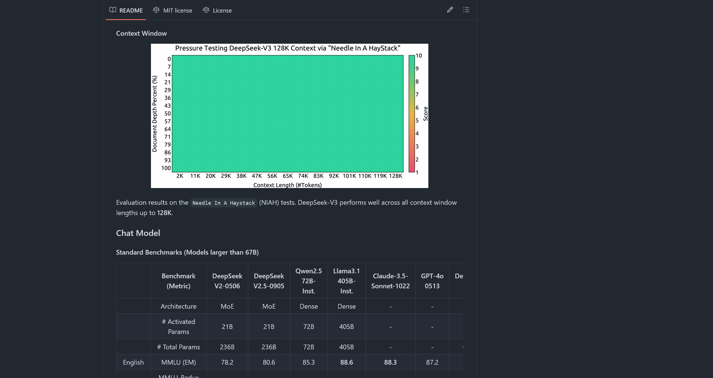

## 介绍

此markdown编辑器是一个基于Android平台的应用，提供编辑和Markdown预览功能，以及支持Markdown文件操作。

## 特点

- 轻量化
- 易上手
- 界面简洁
- 可二次开发
  
## 使用场景

- 技术文档编写
- 日常记录
- 学习和借鉴软件开发

## 应用例子

- 学习通的更新日志是用Markdown制作的

- deepseek的自述文档是使用Markdown形式编写的

## 🌱项目源码

github：https://github.com/WindfuryKun/Markdown-application

gitee：https://gitee.com/rock654/markdown-application

项目演示地址：https://www.bilibili.com/video/BV1JUyvBkEJK/?spm_id_from=333.337.top_right_bar_window_history.content.click&vd_source=9d552df2a3f833dd578a0d16edc18778

项目演示地址：https://www.bilibili.com/video/BV1JUyvBkEJK/?spm_id_from=333.337.top_right_bar_window_history.content.click&vd_source=9d552df2a3f833dd578a0d16edc18778

---

## Introduction

This Markdown editor is an Android application that provides editing and Markdown preview functions, as well as support for Markdown file operations.

## Features

- Lightweight
- Easy to use

- Simple interface

- Customizable

## Use Cases

- Technical documentation writing

- Daily note-taking

- Learning and referencing software development

Project address: https://github.com/WindfuryKun/Markdown-application

Project address 2: https://gitee.com/rock654/markdown-application

<<<<<<< HEAD
Project demonstration address: https://www.bilibili.com/video/BV1JUyvBkEJK/?spm_id_from=333.337.top_right_bar_window_history.content.click&vd_source=9d552df2a3f833dd578a0d16edc18778
=======
Project demonstration address: https://www.bilibili.com/video/BV1JUyvBkEJK/?spm_id_from=333.337.top_right_bar_window_history.content.click&vd_source=9d552df2a3f833dd578a0d16edc18778
>>>>>>> 5750249ca985a86f744761f3f615b3410be849ce
